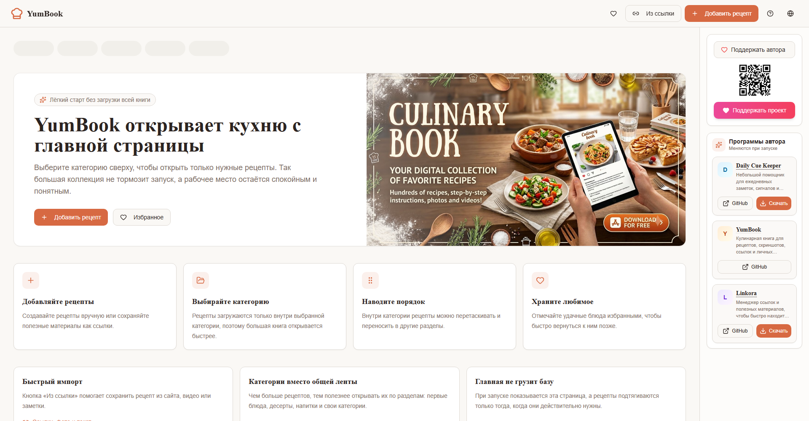

# Taste & Trace / YumBook

Personal digital cookbook for Windows.

Taste & Trace helps you collect recipes, screenshots, links, notes, and favorite dishes in one place. The app is portable: download the `.exe` file and run it without installation.

## Download for Windows

[Download Taste & Trace for Windows x64](https://github.com/milleran41/taste-and-trace-download/releases/download/v0.0.0/Taste.Trace-Portable-0.0.0-x64.exe)

## Antivirus Notice

This portable `.exe` is not signed with a paid code-signing certificate yet. Some antivirus tools may show a warning because the file is new and unsigned.

VirusTotal result: **0 / 56 detections**.

[View the VirusTotal report](https://www.virustotal.com/gui/file/1c1754f84ebafc350fba8cdec75ea00772fe4c32e34ff24173d3f52cf19893b8)

## System Requirements

- Windows 10 or Windows 11
- 64-bit Windows recommended
- No administrator rights required
- Windows 7, Windows 8, and Windows 8.1 are not supported

## Screenshot

## Features

- Recipe collection by categories
- Screenshots and images for recipes
- Import from links and notes
- Favorites
- Drag-and-drop recipe ordering
- Multilingual interface
- Portable Windows app

## Notes

This repository is only a public download page. The application source code is kept separately.
